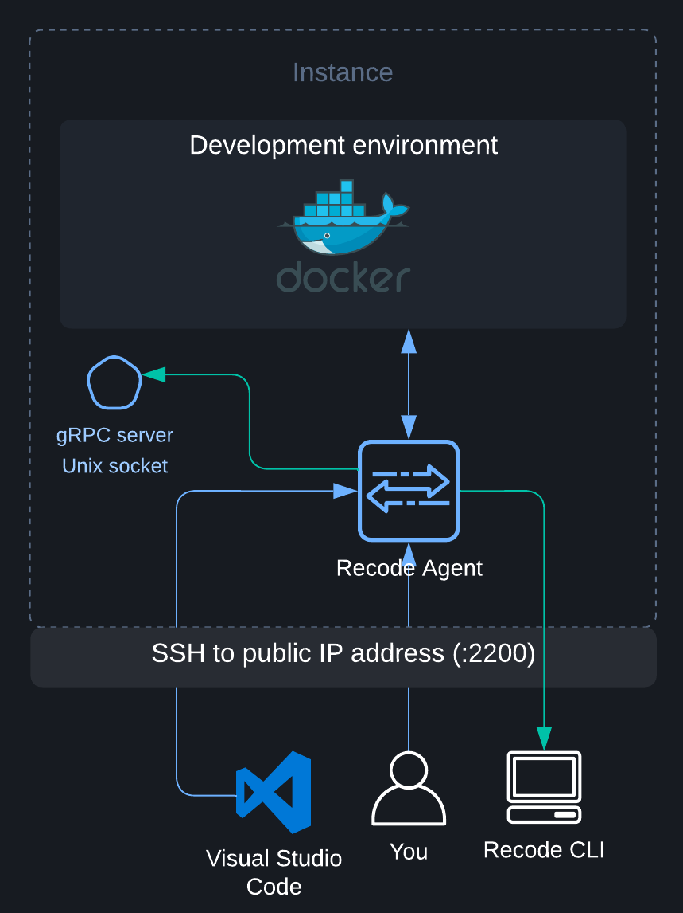

# Agent

This repository contains the source code of the Recode Agent. 

The Recode Agent is installed in the instance running your development environment during its creation (most of the time via `cloud-init` but it may vary depending on the cloud provider used).

The main role of the Recode Agent is to enable communication between your development environment, the [Recode CLI](https://github.com/recode-sh/cli) and your code editor.

It is composed of two components: 

 - A `SSH server`.

 - A `gRPC server`.

## Table of contents
- [Requirements](#requirements)
- [Usage](#usage)
  - [Generating the gRPC server's code](#generating-the-grpc-servers-code)
- [Agent](#agent)
  - [SSH Server](#ssh-server)
  - [GRPC Server](#grpc-server)
- [The future](#the-future)
- [License](#license)

## Requirements

The Recode Agent only works on nix-based OS and requires:

  - `go >= 1.17`

  - `protoc >= 3.0` (see [Protocol Buffer Compiler Installation](https://grpc.io/docs/protoc-installation/))
  
  - `google.golang.org/protobuf/cmd/protoc-gen-go@latest` (install via `go install`)
  
  - `google.golang.org/grpc/cmd/protoc-gen-go-grpc@latest` (install via `go install`)

## Usage

The Recode agent could be run using the `go run main.go` command. 

The `gRPC server` will listen on an Unix socket at `/tmp/recode_grpc.sock` whereas the `SSH server` will listen on `:2200` by default.

### Generating the gRPC server's code

The `gRPC server`'s code could be generated by running the following command **in the `proto` directory**:

```bash
protoc --go_out=. --go_opt=paths=source_relative --go-grpc_out=. --go-grpc_opt=paths=source_relative agent.proto 
```

## Agent

The `SSH server` lets you access your development environment via `SSH` without having to install and configure it. 

The `gRPC server`, on the other hand, is used to enable communication with the [Recode CLI](https://github.com/recode-sh/cli) (via `SSH`, using the OpenSSH's `Unix domain socket forwarding` feature).

<p align="center">
  
</p>

### SSH Server

The `SSH server` is the sole public-facing component. It will listen on port `2200` and redirect traffic to the `gRPC server` or to the `development environment` depending on the requested `channel type`.

**The authentication will be done using the Public Key authentication method**. The key pair will be generated once, during the creation of the development environment.

### GRPC server

The `gRPC server` listens on an Unix socket and, as a result, is not public-facing. It will be accessed by the [Recode CLI](https://github.com/recode-sh/cli) via `SSH`, using the OpenSSH's `Unix domain socket forwarding` feature.

It is principally used to build (and `--rebuild`) your development environment as you can see in the service definition:

```proto
service Agent {
  rpc InitInstance (InitInstanceRequest) returns (stream InitInstanceReply) {}
  rpc BuildAndStartDevEnv (BuildAndStartDevEnvRequest) returns (stream BuildAndStartDevEnvReply) {}
}

message InitInstanceRequest {
  string dev_env_name_slug = 1;
  string github_user_email = 2;
  string user_full_name = 3;
}

message InitInstanceReply {
  string log_line_header = 1;
  string log_line = 2;
  optional string github_ssh_public_key_content = 3;
  optional string github_gpg_public_key_content = 4;
}

message BuildAndStartDevEnvRequest {
  string dev_env_repo_owner = 1;
  string dev_env_repo_name = 2;
  string user_config_repo_owner = 3;
  string user_config_repo_name = 4;
}

message BuildAndStartDevEnvReply {
  string log_line_header = 1;
  string log_line = 2;
}
```

The `InitInstance` method will run a [shell script](https://github.com/recode-sh/agent/blob/main/internal/grpcserver/init_instance.sh) that will, among other things, install `Docker` and generate the `SSH` and `GPG` keys used in GitHub.

The `BuildAndStartDevEnv` method will clone your repositories, build your `dev_env.Dockerfile` files and run your `hooks`.

**The two methods are idempotent**.

## The future

This project is **100% community-driven**, meaning that except for bug fixes <ins>**no more features will be added**</ins>. 

The only features that will be added are the ones that will be [posted as an issue](https://github.com/recode-sh/cli/issues/new) and that will receive a significant amount of upvotes **(>= 10 currently)**.

## License

Recode is available as open source under the terms of the [MIT License](http://opensource.org/licenses/MIT).
